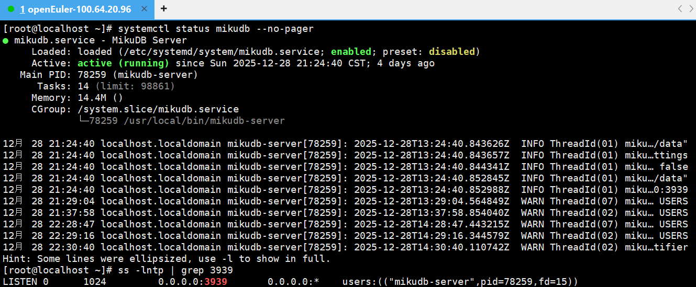
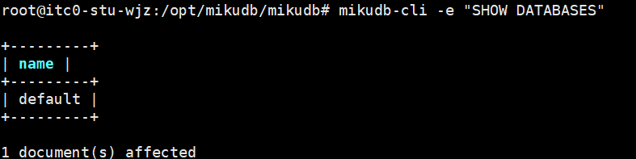
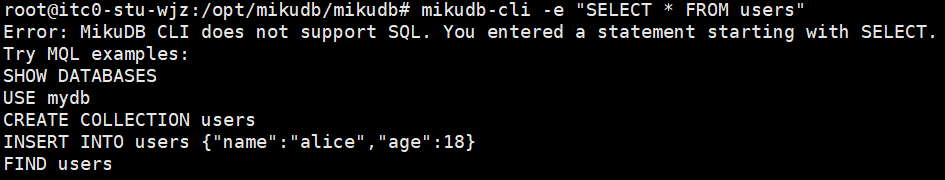

<br>

<div align="center">
    
</div>
<div align="center">
    <h1>MikuDB</h1>
    <h2>基于 OpenEuler 操作系统的非关系型数据库应用</h2>
</div>
<br>
<div align="center">
    
    
    
</div>
<br>
---

## 项目简介

MikuDB 是一个运行于 Linux 环境下的非关系型文档数据库系统，采用 **服务端 + 命令行客户端** 的架构设计。
本项目以 **openEuler 操作系统** 为主要测试与部署平台，重点完成了数据库服务的构建、系统化部署以及基本功能验证。

项目当前以工程实现与系统部署为核心目标，适用于课程设计与实践型项目展示。

---

## 系统架构说明

```
+-------------------+        TCP        +-------------------+
|   mikudb-cli      |  <------------>  |  mikudb-server    |
|  命令行客户端     |                  |  数据库服务端     |
+-------------------+                  +-------------------+
                                              |
                                              |
                                        数据存储模块
```

* **mikudb-server**
  作为数据库核心服务，负责网络监听、请求处理与数据存储。

* **mikudb-cli**
  提供命令行交互接口，用于向服务器发送 MikuDB 查询语言（MQL）指令。

---

## 运行环境要求

* 操作系统：openEuler（已完成验证）
* Rust 工具链（stable）
* systemd 服务管理工具
* 默认监听端口：3939/TCP

---

## 编译与安装（openEuler）

### 获取源码

```bash
git clone <项目仓库地址>
cd mikudb
```

### 编译项目

```bash
cargo build --release
```

### 安装程序

```bash
sudo ./scripts/install.sh
```

安装完成后：

* 可执行文件 `mikudb-server`、`mikudb-cli` 安装至 `/usr/local/bin`
* systemd 服务文件安装为 `mikudb.service`

---

## 服务管理

### 启动服务

```bash
sudo systemctl start mikudb
```

### 设置开机自启

```bash
sudo systemctl enable mikudb
```

### 查看服务状态

```bash
systemctl status mikudb
```

---

## CLI 使用示例

### 正确示例（MQL）

```bash
mikudb-cli -e "SHOW DATABASE"
```

说明：

* CLI 能够成功连接服务器
* 命令正常返回结果
* 无连接中断或异常报错

---

### 不支持的示例（SQL）

```bash
mikudb-cli -e "SELECT * FROM users"
```

说明：

* 当前版本不支持 SQL 语法
* CLI 会在本地拒绝该命令并给出提示
* 不会引发服务器异常或连接错误

---

## 部署验证与验收

以下步骤用于验证系统部署是否成功，可作为答辩或验收依据。

### 服务运行状态与端口监听

```bash
systemctl status mikudb
```

```bash
ss -lntp | grep 3939
```

预期结果：
服务状态显示为 `active (running)`，`mikudb-server` 正在监听 3939 端口。

  
---

### CLI 连通性验证

```bash
mikudb-cli -e "SHOW DATABASES"
```

预期结果：
命令正常返回，无连接异常。

  

---

### 错误输入处理验证

```bash
mikudb-cli -e "SELECT * FROM users"
```

预期结果：

* CLI 明确提示不支持 SQL
* 程序正常退出
* 不影响服务器运行


---

## 已知限制说明

* 当前版本不支持 SQL 语法，仅支持 MQL
* 项目重点在系统部署与基础功能验证
* 未涉及完整数据库特性或高可用集群设计

---

## 项目说明

本项目主要完成了：

* 非关系型数据库服务的基础实现
* openEuler 环境下的编译、安装与服务化部署
* 客户端与服务端的基本功能验证

高级数据库功能及复杂查询支持不在本阶段实现范围内。

---
